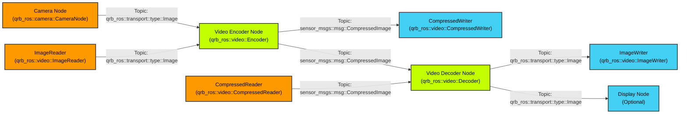

<div align="center">
  <h1>QRB ROS Video</h1>
  <p align="center">
    <!-- Add images or videos to showcase your project demo, use case, or logo -->
  </p>
  <p>Hardware-accelerated video processing package for Qualcomm robotics platforms</p>
  
  <a href="https://docs.ros.org/en/jazzy/" target="_blank"></a>
  
</div>

---

## 👋 Overview

> 📌 **QRB ROS Video Package Features**
> - Hardware-accelerated H.264/H.265 video encoding and decoding using Qualcomm VPU
> - Two interchangeable codec backends selectable at build time — V4L2 (default) and VIDC
> - Zero-copy memory management for high-performance video processing
> - Seamless integration with ROS 2 ecosystem and camera pipelines
> - Support for real-time video streaming and file I/O operations

> 📌 **System Architecture**



> 📌 **Architecture Components:**
> - **Video Encoder Node**: Converts raw images to compressed H.264/H.265 streams using Qualcomm VPU hardware
> - **Video Decoder Node**: Decodes compressed video streams back to raw image frames
> - **Camera Support**: Seamlessly accepts input from QRB ROS Camera package with zero-copy transport
> - **File I/O Components**: CompressedWriter and ImageWriter for saving video data to files
> - **Hardware Acceleration**: Leverages Qualcomm Video Processing Unit (VPU) for efficient encoding/decoding
> - **Memory Management**: Utilizes DMA buffers and qrb_ros_transport for zero-copy operations

## 🔎 Table of Contents

  * [APIs](#-apis)
  * [Codec Backends](#-codec-backends)
  * [Supported Targets](#-supported-targets)
  * [Usage](#-usage)
  * [Build from Source](#-build-from-source)
  * [Contributing](#-contributing)
  * [License](#-license)

## ⚓ APIs

### 🔹 QRB ROS Video APIs

#### ROS Interfaces

**Topics: Encoder**

| Topic | Message Type | Description |
|-------|-------------|-------------|
| `/input` | `qrb_ros::transport::type::Image` | Uncompressed YUV frames |
| `/output` | `sensor_msgs::msg::CompressedImage` | Compressed H.264/H.265 video stream |


**Topics: Decoder**

| Topic | Message Type | Description |
|-------|-------------|-------------|
| `/input` | `sensor_msgs::msg::CompressedImage` | Compressed H.264/H.265 video stream |
| `/output` | `qrb_ros::transport::type::Image` | Decoded YUV frames |

#### ROS Parameters

**Video Encoder Parameters:**

| Parameter | Type | Default | Description |
|-----------|------|---------|-------------|
| `format` | string | "h264" | Video codec format (h264/h265) |
| `pixel_format` | string | "nv12" | Input pixel format (nv12/p010) |
| `width` | int | 1920 | Video width |
| `height` | int | 1080 | Video height |
| `framerate` | int | 30 | Frames per second |
| `bitrate` | int | 5000000 | Target bitrate in bits/second |
| `rate_control` | string | "variable" | Rate control mode (variable/cbr) |
| `profile` | string | "main" | Codec profile (baseline/main/high) |
| `level` | string | "4.1" | Codec level |

**Video Decoder Parameters:**

| Parameter | Type | Default | Description |
|-----------|------|---------|-------------|
| `format` | string | "h264" | Input codec format |
| `pixel-format` | string | "nv12" | Output pixel format |

## 🔌 Codec Backends

The hardware codec functionality lives in the `qrb_video_lib` package, which ships
two interchangeable backends behind a single shared library
(`libqrb_video_codec.so`). The backend is chosen **at build time** via the
`ENABLE_VIDC_BACKEND` CMake option — the ROS interfaces, topics, and parameters
described above are identical regardless of which backend is compiled in.

| Backend | CMake Option | Default | Description |
|---------|--------------|---------|-------------|
| **V4L2** | `-DENABLE_VIDC_BACKEND=OFF` | ✅ Yes | Uses the Linux kernel V4L2 codec interface (`/dev/video*`). No extra dependencies beyond the standard toolchain. |
| **VIDC** | `-DENABLE_VIDC_BACKEND=ON` | No | Uses the Qualcomm VIDC client library for direct access to the Video Processing Unit. Requires `video-driver-dev` and `mm-osal-dev`. |

When `ENABLE_VIDC_BACKEND=ON`, the build additionally links against
`libvidc_client` and compiles the sources under `qrb_video_lib/src/vidc/`.
The prebuilt Debian package distributed through the Qualcomm PPA is built with
the **VIDC backend enabled**.

To select a backend when building the library from source:

```bash
# V4L2 backend (default)
cmake -B build -DENABLE_VIDC_BACKEND=OFF
cmake --build build

# VIDC backend
cmake -B build -DENABLE_VIDC_BACKEND=ON
cmake --build build
```

## 🎯 Supported Targets

- **Ubuntu 24.04 LTS (Noble)**
- **ROS 2 Humble and Jazzy**

Hardware Requirements:
- Qualcomm Video Processing Unit (VPU) for hardware acceleration
- Camera module compatible with qrb_ros_camera package (optional)

---

## 🚀 Usage

**Example workflows:**

1. **Local Video File Recording:**
   ```bash
   # Preparation: 
   # push YUV sample file 1920_1080_nv12.yuv to /data/ directory

   # Execution:
   ros2 launch qrb_ros_video encoder_launch.py
   ```

2. **Local Video File Playback:**
   ```bash
   # Preparation: 
   # push YUV sample file 1920_1080.mp4 to /data/ directory

   # Execution:
   ros2 launch qrb_ros_video decoder_launch.py
   ```
---

## 👨‍💻 Build from Source

The Debian packages are built from the Ubuntu workspace using the
`build-utils/ubuntu/build.py` helper, which builds each package inside a clean
`sbuild` chroot (`noble-arm64-ubuntu` under `/srv/chroot`) and resolves all
build dependencies automatically.

### Prerequisites (one time per build server)

Run `ci-setup.sh` **once** as root to install the build tooling (`sbuild`,
`mmdebstrap`, `uidmap`, …) and configure the unprivileged-user-namespace
environment that `--gen-debians` requires:

```bash
sudo bash build-utils/ubuntu/ci-setup.sh
```

This adds the build user to the `sbuild` group and sets up `subuid`/`subgid`
mappings — log out and back in (or run `newgrp sbuild`) afterwards so the group
change takes effect. The sbuild base tarball is created automatically by
`build.py` on first use, so no manual chroot creation is needed.

### Build

From the **workspace root**, build the package and its dependencies with:

```bash
python3 build-utils/ubuntu/build.py --gen-debians --package ros-jazzy-qrb-ros-video-test
```

This builds the full dependency chain — `qrb_video_lib`
(`libqrb-video-codec`), `qrb_ros_video`, and the `ros-jazzy-qrb-ros-video-test`
utilities — and drops the generated `.deb`s under `debian_packages/`.

| Flag | Description |
|------|-------------|
| `--gen-debians` | Generate the Debian binary packages. |
| `--package <name>` | Source package to build (dependencies are built as needed). Use `ros-jazzy-qrb-ros-video` to build without the test utilities. |

> The codec library's `debian/rules` enables the VIDC backend by default
> (`-DENABLE_VIDC_BACKEND=ON`). To build the V4L2-only backend instead, edit
> `qrb_video_lib/debian/rules` to set `-DENABLE_VIDC_BACKEND=OFF`. See
> [Codec Backends](#-codec-backends) for the trade-offs.

## 🤝 Contributing

We love community contributions! Get started by reading our [CONTRIBUTING.md](CONTRIBUTING.md).  
Feel free to create an issue for bug reports, feature requests, or any discussion 💡.

## ❤️ Contributors

> 📌 **[Jean Xiao](jianxiao@qti.qualcomm.com)** 

## 📜 License

Project is licensed under the [BSD-3-clause License](https://spdx.org/licenses/BSD-3-Clause.html). See [LICENSE](./LICENSE) for the full license text.

