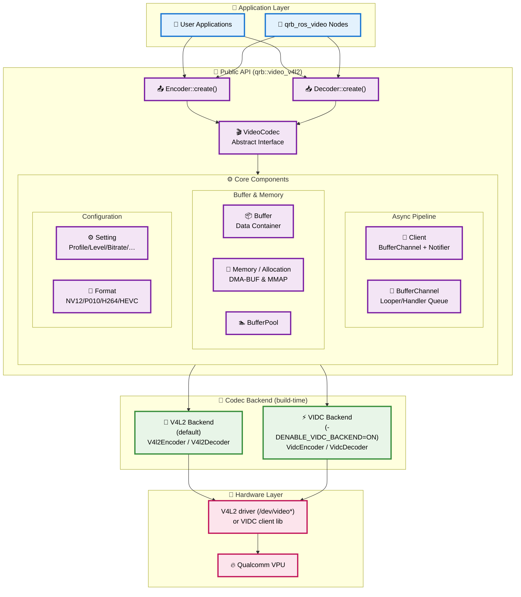

<div align="center">
  <h1>QRB Video Codec Library</h1>
  <p align="center">
    <!-- Add images or videos to showcase your project demo, use case, or logo -->
  </p>
  <p>Hardware-accelerated video encoding and decoding library for Qualcomm platforms</p>

  <a href="https://docs.ros.org/en/jazzy/" target="_blank"></a>

</div>

---

## 👋 Overview

> 📌 **Introduction to the project**
> - Hardware-accelerated video codec library implementing H.264/H.265 encoding and decoding
> - Ships **two interchangeable backends** selected at build time — V4L2 (default) and VIDC
> - Single unified C++ interface (`VideoCodec`) regardless of the active backend
> - Asynchronous, buffer-based pipeline with zero-copy DMA-BUF support
> - Designed for real-time video processing on Qualcomm SoCs

The library builds into a single shared object, `libqrb_video_codec.so`
(CMake target `qrb_video_codec`), and is distributed as the Debian packages
`libqrb-video-codec-1` (runtime) and `libqrb-video-codec-dev` (headers + CMake
config). All public symbols live in the `qrb::video_v4l2` namespace.

> 📌 **Architecture diagram**



> 📌 **Architecture description:**
> - **🎯 Application Layer**: User applications and the `qrb_ros_video` ROS 2 nodes call into the library through `Encoder`/`Decoder`.
> - **🔧 Public API**: `VideoCodec` is the abstract interface; `Encoder::create()` / `Decoder::create()` return a `Client` that implements it. `BufferChannel` runs the asynchronous pipeline on a `Looper`/`Handler` thread.
> - **⚙️ Core Components**: buffer/memory management (`Buffer`, `Memory`, `Allocation`, `BufferPool`) and configuration (`Setting`, `Format`).
> - **🔀 Codec Backend**: exactly one backend is compiled in. **V4L2** (default) talks to the kernel V4L2 codec interface; **VIDC** (`-DENABLE_VIDC_BACKEND=ON`) links the Qualcomm VIDC client library. The public API is identical for both.
> - **🔧 Hardware Layer**: the chosen backend drives the Qualcomm VPU.

## 🔎 Table of Contents

  * [Codec Backends](#-codec-backends)
  * [APIs](#-apis)
  * [Usage](#-usage)
  * [Supported Targets](#-supported-targets)
  * [Build from Source](#-build-from-source)
  * [FAQs](#-faqs)

## 🔀 Codec Backends

The codec functionality is provided by one of two backends, chosen **at build
time** through the `ENABLE_VIDC_BACKEND` CMake option. Both produce the same
`libqrb_video_codec.so` and expose the identical public API — only the
underlying driver path differs.

| Backend | CMake Option | Default | Sources | Extra Dependencies |
|---------|--------------|---------|---------|--------------------|
| **V4L2** | `-DENABLE_VIDC_BACKEND=OFF` | ✅ Yes | `src/v4l2/` | none beyond the base toolchain |
| **VIDC** | `-DENABLE_VIDC_BACKEND=ON` | No | `src/vidc/` | `libvidc_client` (`video-driver-dev`), `mm-osal-dev`, `common-headers-dev` |

`Encoder::create()` and `Decoder::create()` dispatch to the compiled-in backend
(`V4l2Encoder`/`V4l2Decoder` or `VidcEncoder`/`VidcDecoder`) behind the
`ENABLE_VIDC_BACKEND` macro, so application code never references a backend
directly.

> **Note:** the Debian package shipped through the Qualcomm PPA is built with
> the **VIDC backend enabled** (`debian/rules` sets `-DENABLE_VIDC_BACKEND=ON`).

## ⚓ APIs

All types are declared in the `qrb::video_v4l2` namespace and exported under
`<install-prefix>/include/qrb_video/`.

### 🔹 Entry Points

| Class | Header | Factory | Returns |
|-------|--------|---------|---------|
| `Encoder` | `Encoder.hpp` | `Encoder::create(std::string mime)` | `std::shared_ptr<Client>` |
| `Decoder` | `Decoder.hpp` | `Decoder::create(std::string mime)` | `std::shared_ptr<Client>` |

The `mime` argument selects the codec; two constants are provided in
`VideoCodec.hpp`:

| Constant | Value |
|----------|-------|
| `MIME_H264` | `"video/x-h264"` |
| `MIME_H265` | `"video/x-h265"` |

### 🔹 `VideoCodec` Interface

`VideoCodec` (in `VideoCodec.hpp`) is the abstract base implemented by the
returned `Client`:

| Method | Description |
|--------|-------------|
| `bool configure(const Setting & s)` | Apply a configuration setting (see below). |
| `bool start()` | Start the codec session. |
| `bool stop()` | Stop the codec session. |
| `bool pause()` | Pause processing. |
| `bool seek()` | Flush/seek the pipeline. |
| `std::shared_ptr<Buffer> acquireBuffer()` | Acquire a free buffer from the pool. |
| `bool queueBuffer(const std::shared_ptr<Buffer> & item)` | Queue an input buffer for processing. |
| `bool dispatchBuffer(const std::shared_ptr<Buffer> & item)` | Return a consumed output buffer to the pipeline. |
| `void setNotifier(const std::shared_ptr<Notifier> & notifier)` | Register a callback for output buffers. |

Completed buffers are delivered asynchronously through
`VideoCodec::Notifier::onBufferAvailable(const std::shared_ptr<Buffer> &)`,
which the application implements.

### 🔹 Buffer & Memory

| Type | Header | Role |
|------|--------|------|
| `Buffer` | `Buffer.hpp` | Frame/bitstream container; carries timestamp, sequence, `bytesused`, EOS flag, and a `Memory`. Create with `Buffer::create(allocation)`. |
| `Memory` | `Memory.hpp` | Backing store (`Linear` or `Graphics`); `map()`/`unmap()`/`data()`/`fd()`. |
| `Allocation` | `Memory.hpp` | Describes an import: `fd`, `size`, `offset`, `Usage` (`MMAP` or `DMABUF`), and a `MemoryView`. |
| `MemoryView` | `Memory.hpp` | Pixel layout: `Format pixelfmt`, `width`, `height`, and per-plane `stride`/`scanline`/`size`. |
| `BufferPool` | `BufferPool.hpp` | Allocates and recycles `Buffer` instances. |

### 🔹 Configuration (`Setting`)

A `Setting` is built with `Setting::create(<struct>)` and applied via
`configure()`. The setting structs (in `VideoCodec.hpp`) and the `Format` enum
(in `Memory.hpp`) are:

| Setting | Struct | Fields | Notes |
|---------|--------|--------|-------|
| `RESOLUTION` | `Resolution` | `uint32_t width, height` | Frame dimensions. |
| `FORMAT` | `Format` (enum) | — | Pixel/codec format: `NV12`, `NV12C`, `P010`, `TP10C`, `H264`, `HEVC`. |
| `FRAMERATE` | `Framerate` | `uint32_t value` | Frames per second. |
| `BITRATE` | `Bitrate` | `int32_t value`, `Mode mode`, `bool enable` | `Mode` ∈ `{OFF, CBR, VBR}`. Encoder only. |
| `PROFILE` | `Profile` | `uint32_t value` | `AVC_BASELINE/CONSTRAINED_BASELINE/MAIN/HIGH/CONSTRAINED_HIGH`, `HEVC_MAIN/MAIN10/MAIN_STILL`. |
| `LEVEL` | `Level` | `uint32_t value` | `AVC_1_0 … AVC_6_2`, `HEVC_1_0 … HEVC_6_2`. |
| `COUNT` | `BufferCount` | `size_t value` | Hint for the number of port buffers. |

> The active driver ultimately determines which values and ranges are
> supported.

## 🚀 Usage

The library is consumed from CMake via the exported package:

```cmake
find_package(qrb_video_lib REQUIRED)
target_link_libraries(my_app PRIVATE qrb_video_codec)
```

Typical encode/decode flow:

1. Create a codec: `auto codec = Encoder::create(MIME_H264);` (or `Decoder::create`).
2. Register a notifier: `codec->setNotifier(my_notifier);`.
3. Configure with `Setting::create(...)` + `codec->configure(...)`.
4. `codec->start();`
5. Submit work with `codec->queueBuffer(buffer)`; receive results in
   `onBufferAvailable()` and return them with `dispatchBuffer()`.
6. `codec->stop();` when done.

Example (encoder setup):

```cpp
using namespace qrb::video_v4l2;

auto encoder = Encoder::create(MIME_H264);
encoder->setNotifier(my_notifier);   // implements VideoCodec::Notifier

Resolution res{ .width = 1920, .height = 1080 };
encoder->configure(Setting::create(res));

Framerate fr{ .value = 30 };
encoder->configure(Setting::create(fr));

Bitrate br{ .value = 10'000'000, .mode = Bitrate::CBR, .enable = true };
encoder->configure(Setting::create(br));

Profile prof{ .value = Profile::AVC_HIGH };
encoder->configure(Setting::create(prof));

encoder->start();

// Import a DMA-BUF frame and queue it:
auto allocation = std::make_shared<Allocation>();
allocation->fd = dmabuf_fd;
allocation->size = frame_size;
allocation->flags = Allocation::Usage::DMABUF;
allocation->view.pixelfmt = Format::NV12;
allocation->view.width = 1920;
allocation->view.height = 1080;
auto buffer = Buffer::create(allocation);
buffer->bytesused = frame_size;
encoder->queueBuffer(buffer);
```

## 🎯 Supported Targets

- Qualcomm platforms with VPU hardware acceleration
- **Ubuntu 24.04 LTS (Noble)**

Backend-specific requirements:
- **V4L2 backend**: a kernel exposing the V4L2 codec interface (`/dev/video*`).
- **VIDC backend**: the Qualcomm VIDC client library and video driver
  (`video-driver` runtime; `video-driver-dev`, `mm-osal-dev`,
  `common-headers-dev` at build time).

---

## 👨‍💻 Build from Source

The Debian packages are built from the Ubuntu workspace using the
`build-utils/ubuntu/build.py` helper, which builds each package inside a clean
`sbuild` chroot (`noble-arm64-ubuntu` under `/srv/chroot`) and resolves all
build dependencies automatically.

### Prerequisites (one time per build server)

Run `ci-setup.sh` **once** as root to install the build tooling (`sbuild`,
`mmdebstrap`, `uidmap`, …) and configure the unprivileged-user-namespace
environment that `--gen-debians` requires:

```bash
sudo bash build-utils/ubuntu/ci-setup.sh
```

This adds the build user to the `sbuild` group and sets up `subuid`/`subgid`
mappings — log out and back in (or run `newgrp sbuild`) afterwards so the group
change takes effect. The sbuild base tarball is created automatically by
`build.py` on first use, so no manual chroot creation is needed.

### Build

From the **workspace root**, build the codec library and its dependencies with:

```bash
python3 build-utils/ubuntu/build.py --gen-debians --package libqrb-video-codec-dev
```

This builds the `qrb-video-lib` source package and drops the generated `.deb`s
(`libqrb-video-codec-1`, `libqrb-video-codec-dev`) under `debian_packages/`.

| Flag | Description |
|------|-------------|
| `--gen-debians` | Generate the Debian binary packages. |
| `--package <name>` | Binary package to build (dependencies are built as needed). Use `libqrb-video-codec-dev` for the headers + library, or `ros-jazzy-qrb-ros-video-test` to build the whole `qrb_ros_video` stack. |

> The `debian/rules` enables the VIDC backend by default
> (`-DENABLE_VIDC_BACKEND=ON`). To build the V4L2-only backend instead, edit
> `debian/rules` to set `-DENABLE_VIDC_BACKEND=OFF`. See
> [Codec Backends](#-codec-backends) for the trade-offs.

## ❔ FAQs

<details>
<summary>What is the difference between the V4L2 and VIDC backends?</summary><br>
Both implement the same <code>VideoCodec</code> API and produce the same shared
library. The V4L2 backend (default) drives the kernel V4L2 codec interface; the
VIDC backend links the Qualcomm VIDC client library directly. Pick one at build
time with <code>-DENABLE_VIDC_BACKEND</code>. Application code does not change.
</details>

<details>
<summary>What video codecs are supported?</summary><br>
H.264 (<code>MIME_H264</code>) and H.265/HEVC (<code>MIME_H265</code>), subject
to the capabilities of the underlying Qualcomm hardware.
</details>
